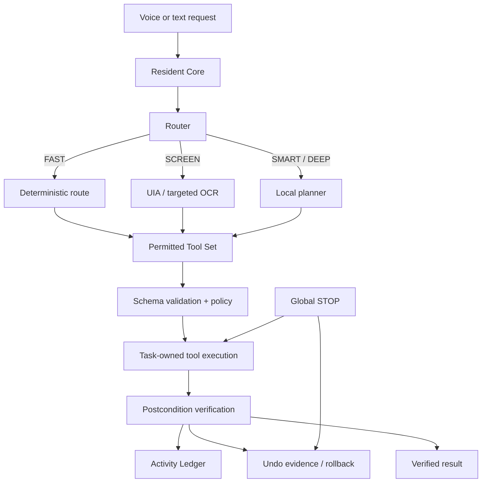

# PLUMA

**A local-first Windows 11 automation system with voice input, screen-aware control, typed tools, verification, rollback, and an on-demand local reasoning layer.**

PLUMA is built around a simple constraint: natural language can interpret intent, but it should not directly control the operating system. Voice and text requests enter the same pipeline, deterministic routes are tried first, and every real action is executed through registered tools with policy checks, task ownership, and postcondition verification.

The resident process stays lightweight. Local STT, OCR, and LLM runtimes are loaded only when a task needs them and are unloaded again after a short idle period.

> **Current state:** the automation core, safety model, local reasoning path, packaging, and release hardening are implemented. The final Windows UI and UI-to-core integration are still in progress.

## How it works



The planner is not an execution API. It can propose bounded tool calls, but those calls still have to exist in the registry, validate against their schemas, pass route permissions and policy, execute under the task supervisor, and verify their result.

## Key engineering decisions

### Deterministic paths before model inference

Simple commands such as opening an application, changing volume, or querying system state do not need an LLM. PLUMA routes those requests directly to deterministic tools and only starts the planner when interpretation or decomposition is actually required.

This reduces latency and idle resource cost while keeping model output away from actions that already have a reliable deterministic path.

### UI Automation before OCR or coordinates

Screen interaction follows this order:

```text
Native / application API
        ↓
Windows UI Automation
        ↓
Stable keyboard / input path
        ↓
Targeted OCR
        ↓
Freshness-checked coordinates
```

UIA gives PLUMA semantic controls instead of raw pixels. OCR is scoped to the active window or a target region when UIA cannot expose the required text. Coordinate interaction is a last resort and is rejected when its snapshot is stale or the target window has changed.

### Task ownership instead of loose background work

Every command is represented by a task capsule managed by a `TaskSupervisor`. Spawned workers are associated with Windows Job Objects where appropriate so PLUMA can terminate its own process tree without blindly killing unrelated user applications.

The global STOP path sets a cancellation latch, blocks new steps, terminates unresponsive PLUMA-owned workers, performs safe rollback where possible, and releases task-owned resources.

### Verification before success

A state-changing tool does not report success just because the call returned without an exception. Tools define postconditions and read the relevant state back using native APIs, UIA, OCR, or system state as appropriate.

That verification result is written to the local Activity Ledger together with sanitized arguments, timings, errors, and available undo information.

### Local storage and bounded memory

PLUMA uses SQLite because it is a single-user local application and does not need a database server. The Activity Ledger stores factual execution history, while preferences, aliases, and routines remain local.

Raw screenshots and microphone audio are not persisted by default.

### Replaceable local runtimes

The architecture keeps model-specific and automation-specific dependencies behind adapters. The resident core does not depend directly on a particular LLM, OCR engine, or UI automation implementation.

The current baseline uses local `llama.cpp`, `whisper.cpp`, UI Automation, and targeted OCR, but those components are intentionally replaceable.
