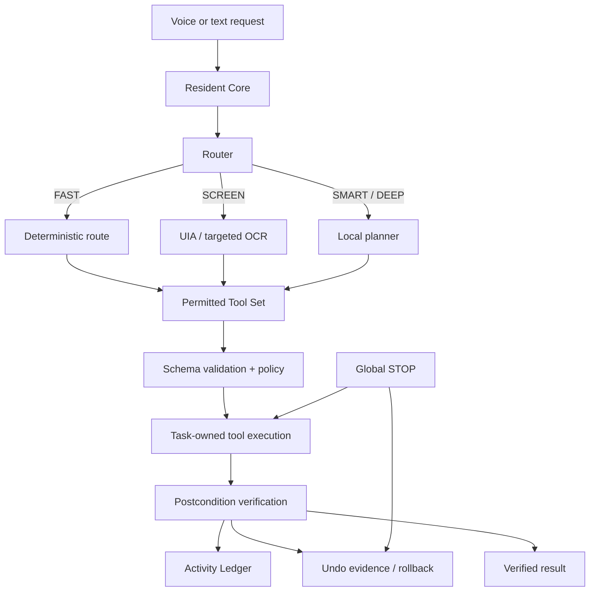

# PLUMA

**A local-first Windows 11 automation system with voice input, screen-aware control, typed tools, verification, rollback, and an on-demand local reasoning layer.**

PLUMA is built around a simple constraint: natural language can interpret intent, but it should not directly control the operating system. Voice and text requests enter the same pipeline, deterministic routes are tried first, and every real action is executed through registered tools with policy checks, task ownership, and postcondition verification.

The resident process stays lightweight. Local STT, OCR, and LLM runtimes are loaded only when a task needs them and are unloaded again after a short idle period.

> **Current state:** the automation core, safety model, local reasoning path, packaging, and release hardening are implemented. The final Windows UI and UI-to-core integration are still in progress.

## Demo status

There is no polished screenshot or GIF in the repository yet because the final Windows shell is not complete. The `pluma/ui` package currently defines the functional contracts for command entry, task state, confirmations, STOP, Activity Ledger access, settings, and errors; the creator-directed visual layer is still being integrated.

A real interaction recording should be added here once that UI path is complete. Until then, the repository evidence is the implementation, tests, release artifacts, and verification logs rather than a mocked interface.

## How it works



The planner is not an execution API. It can propose bounded tool calls, but those calls still have to exist in the registry, validate against their schemas, pass route permissions and policy, execute under the task supervisor, and verify their result.

## Key engineering decisions

### Deterministic paths before model inference

Simple commands such as opening an application, changing volume, or querying system state do not need an LLM. PLUMA routes those requests directly to deterministic tools and only starts the planner when interpretation or decomposition is actually required.

This reduces latency and idle resource cost while keeping model output away from actions that already have a reliable deterministic path.

### UI Automation before OCR or coordinates

Screen interaction follows this order:

```text
Native / application API
        ↓
Windows UI Automation
        ↓
Stable keyboard / input path
        ↓
Targeted OCR
        ↓
Freshness-checked coordinates
```

UIA gives PLUMA semantic controls instead of raw pixels. OCR is scoped to the active window or a target region when UIA cannot expose the required text. Coordinate interaction is a last resort and is rejected when its snapshot is stale or the target window has changed.

### Task ownership instead of loose background work

Every command is represented by a task capsule managed by a `TaskSupervisor`. Spawned workers are associated with Windows Job Objects where appropriate so PLUMA can terminate its own process tree without blindly killing unrelated user applications.

The global STOP path sets a cancellation latch, blocks new steps, terminates unresponsive PLUMA-owned workers, performs safe rollback where possible, and releases task-owned resources.

### Verification before success

A state-changing tool does not report success just because the call returned without an exception. Tools define postconditions and read the relevant state back using native APIs, UIA, OCR, or system state as appropriate.

That verification result is written to the local Activity Ledger together with sanitized arguments, timings, errors, and available undo information.

### Local storage and bounded memory

PLUMA uses SQLite because it is a single-user local application and does not need a database server. The Activity Ledger stores factual execution history, while preferences, aliases, and routines remain local.

Raw screenshots and microphone audio are not persisted by default.

### Replaceable local runtimes

The architecture keeps model-specific and automation-specific dependencies behind adapters. The resident core does not depend directly on a particular LLM, OCR engine, or UI automation implementation.

The current baseline uses local `llama.cpp`, `whisper.cpp`, UI Automation, and targeted OCR, but those components are intentionally replaceable.


## Implemented capability surface

The current tool registry exposes concrete Windows operations rather than generic "agent actions".

| Area | Implemented operations |
|---|---|
| Files | `list_files`, `find_file`, `move_file`, `rename_file`, `create_folder` |
| Applications | `open_app`, `close_app`, `focus_app`, `list_apps`, `app_status` |
| Windows | `list_windows`, `focus_window`, `minimize_window`, `maximize_window`, `restore_window` |
| Audio | `set_volume`, `mute`, `unmute`, `get_volume_status` |
| System | `get_system_status`, `battery_status`, `stop_current`, `show_activity`, `undo_last` |
| Clipboard | `get_clipboard_text`, `set_clipboard_text`, `clear_clipboard` |
| Screen interaction | `inspect_active_window`, `click_element`, `type_into_element`, `click_ocr_text` |

The screen tools use snapshot-backed targets rather than accepting arbitrary model-generated coordinates.

## Tech stack

Grouped by what each component is responsible for:

- **Core runtime:** Python 3.12+, Pydantic, PyYAML
- **Windows integration:** `ctypes`, pywin32, pycaw, comtypes
- **Desktop automation:** Microsoft UI Automation through pywinauto
- **Voice capture:** sounddevice + local VAD
- **Speech-to-text:** local `whisper.cpp` adapter
- **Planner:** local `llama.cpp` adapter with structured output and second-pass validation
- **Screen perception:** targeted window capture + OCR adapter
- **Persistence:** SQLite with local activity, preference, alias, routine, undo, and resource state
- **Process control:** Windows Job Objects + cooperative cancellation
- **Testing:** pytest, adversarial cases, benchmark tests, and soak tests
- **Packaging:** wheel + PyInstaller executable + Windows installer/uninstaller scripts

Heavy ML runtimes and model files are intentionally not imported by the resident process at startup.

## Repository structure

```text
pluma/
├── app.py                  # production entry point and runtime wiring
├── core/                   # routing, orchestration, task ownership, IPC, recovery
├── tools/                  # typed tool contracts and Windows operations
├── adapters/               # Win32, PowerShell, UIA, input and screen boundaries
├── brain/                  # local planner adapter, prompts, schemas and tool subsets
├── perception/             # active-window context, UIA snapshots, OCR and freshness
├── voice/                  # capture, VAD, STT lifecycle and voice request pipeline
├── policy/                 # risk rules and bounded elevation
├── verify/                 # postcondition verification
├── rollback/               # undo recipes and reverse-order rollback
├── memory/                 # SQLite, Activity Ledger, redaction and local stores
├── ui/                     # functional UI contracts; final visual shell is not complete
└── config/                 # runtime defaults and policy configuration

tests/
├── unit/                   # component, adversarial and regression coverage
├── benchmarks/             # latency and memory/soak checks
└── fixtures/               # golden command and deterministic test data

build_release.py            # wheel, EXE, ZIP and checksum build
install.ps1                 # isolated Windows installation
uninstall.ps1               # removal / cleanup path
release/                    # packaged release artifacts
```

The main architectural boundary is deliberate: core code should not depend directly on pywinauto classes, OCR-library objects, PowerShell implementation details, or a specific local model runtime.


## Running locally

### Prerequisites

- Windows 11 x64
- Python 3.12+
- Git

Clone and create an isolated development environment:

```powershell
git clone https://github.com/sai161812/pluma.git
cd pluma

python -m venv .venv
.venv\Scripts\Activate.ps1

pip install -e ".[windows,media,dev]"
```

Start the resident process:

```powershell
pluma --debug
```

The repository does **not** vendor local model weights or the external C/C++ runtime binaries used by the planner/STT/OCR adapters. Those assets need to be configured locally before exercising the corresponding SMART, voice, or OCR paths.

For packaged installation, the release bundle contains the wheel, `pluma.exe`, installer scripts, configuration, and SHA-256 manifest:

```powershell
.\install.ps1
```

## Testing and release verification

Run the repository test suite with:

```powershell
python -m pytest tests
```

The test tree includes unit, regression, adversarial, Windows-integration, benchmark, memory/soak, routing, policy, rollback, IPC, UI-grounding, and lifecycle checks.

The final release verification report dated **August 28, 2026** records:

| Result | Value |
|---|---:|
| Collected tests | 716 |
| Passed | 713 |
| Environment-specific skips | 3 |
| Failed | 0 |
| Deterministic acceptance gates | 9 / 9 passed |

The release build also produces:

- `dist/pluma-0.1.0-py3-none-any.whl`
- `dist/pluma.exe`
- `release/pluma-0.1.0-windows-x64-release.zip`
- `release/SHA256SUMS.txt`

Build from source with:

```powershell
python build_release.py
```

### Verification evidence

- [`FINAL_RELEASE_REPORT.md`](FINAL_RELEASE_REPORT.md) — final verification matrix and packaged artifacts
- [`ACCEPTANCE_TEST_RAW_LOG.txt`](ACCEPTANCE_TEST_RAW_LOG.txt) — raw acceptance-test output
- [`PLUMA_ACCEPTANCE_TESTS.md`](PLUMA_ACCEPTANCE_TESTS.md) — acceptance gates and expected behavior
- [`PLUMA_MASTER_SPEC.md`](PLUMA_MASTER_SPEC.md) — product and engineering specification
- [`PLUMA_TECH_STACK.md`](PLUMA_TECH_STACK.md) — implementation/runtime contract


## Current limitations

These are product boundaries, not hidden roadmap items:

- **Application coverage is not universal.** Secure desktops, elevated applications, anti-automation software, remote sessions, games, custom-rendered canvases, and inaccessible controls can block UIA or normal input automation.
- **OCR is text grounding, not general vision.** A textless visual object with no UIA semantics is not a reliable V1 target.
- **Undo only applies where a real inverse exists.** Sent messages, remote submissions, external side effects, and some destructive actions cannot be guaranteed reversible after commit.
- **PLUMA does not continuously watch the screen.** Perception is task-scoped and targeted.
- **The planner does not receive unrestricted shell or administrator access.** Elevated operations go through typed, bounded paths.
- **The final visual UI is not complete yet.** The core exposes UI contracts, but the finished shell and its integration are still active work.

## Project references

For deeper implementation detail:

- [`PLUMA_BUILD_PLAN.md`](PLUMA_BUILD_PLAN.md) — ordered implementation phases
- [`AGENTS.md`](AGENTS.md) — architecture and safety constraints used during implementation
- [`PROJECT_HANDOFF.md`](PROJECT_HANDOFF.md) — live engineering continuity/state record
